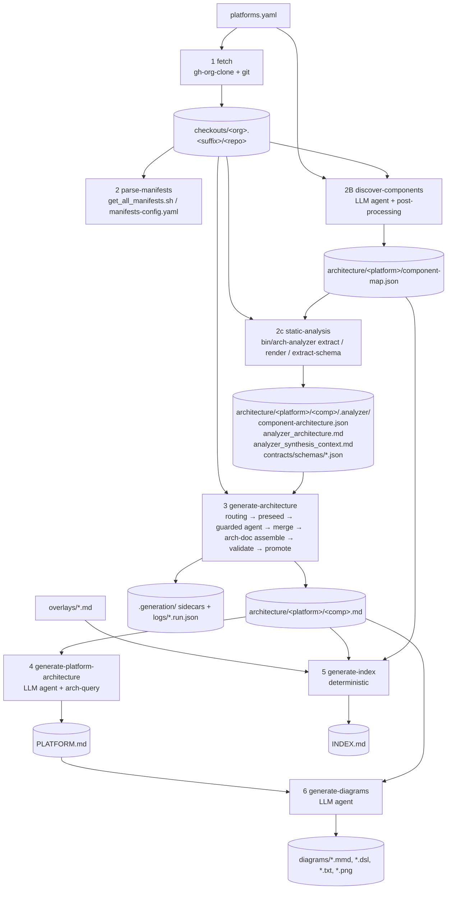

# Pipeline Architecture

An architectural breakdown of the `main.py` pipeline that turns ODH / RHOAI
component repositories into the versioned architecture corpus under
`architecture/`. Starting breadcrumb: `uv run main.py all --help`.

This document describes the code as it exists in the working tree on
2026-09-06 (branch `regen/praxis-repos`, with a large uncommitted diff on top
of commit `39209078`). Where the code and the README disagree, the code wins
and the discrepancy is called out in the assessment.

---

## 1. One-paragraph summary

The pipeline is a Python 3.13 / `asyncio` orchestrator (`main.py` + `lib/`)
that runs up to eight phases in order: clone repositories, parse the operator
manifest list, discover components with an LLM agent, run a project-owned Go
static analyzer, synthesize a per-component architecture document with a
tightly constrained LLM agent, aggregate a platform document, render a
deterministic index, and draw diagrams. The central design idea, formalized
in ADR-0019 and ADR-0022, is **analyzer-owned facts with bounded,
evidence-gated agent synthesis**: the Go `arch-analyzer` produces the
authoritative structured tables, and the agent may only add narrative sections
and evidence-backed table edits that survive a deterministic merge and a Go
`arch-doc assemble` step before promotion. LLM work runs through a pluggable
harness (Claude Agent SDK by default, OpenAI Codex optionally) and invokes
checked-in skills under `.claude/skills/` as slash commands.

---

## 2. Entry point and command surface

`main.py` is thin: it parses args (`lib/cli.py`), loads `.env` (required only
when a Claude agent phase will run), then `asyncio.run(lib.phases.main(args))`.

`lib/phases/orchestration.py::main` dispatches on `args.command`:

| Subcommand | Phase label in code | Agent? | Runs |
|---|---|---|---|
| `fetch` | Phase 1 | no | `lib/phases/fetch.py` → `lib/fetch.py` |
| `parse-manifests` | Phase 2 | no | `lib/phases/manifest.py` → `lib/manifest_parser.py` |
| `discover-components` | Phase 2B | **yes** | `lib/phases/discover.py` |
| `static-analysis` | Phase 2c | no (Go subprocess) | `lib/phases/static_analysis.py` |
| `generate-architecture` | Phase 3 | **yes** | `lib/phases/architecture.py` |
| `generate-platform-architecture` | Phase 4 | **yes** | `lib/phases/platform.py` |
| `generate-index` | Phase 5 | no | `lib/phases/index.py` → `lib/version_index.py` |
| `generate-diagrams` | Phase 6 | **yes** | `lib/phases/diagrams.py` |
| `check-eligibility` | reporting only | no | `lib/phases/eligibility.py` |
| `pipeline` | targeted subset | depends | `run_pipeline_phases` |
| `all` | everything above except eligibility | depends | `run_all_phases` |

`all --help` exposes the knobs that matter for a full run:

- **Scope**: `--platform` (key in `platforms.yaml`), `--org`, `--branch`,
  `--suffix`, `--version`, `--tier {all,significant,core}`.
- **Agent**: `--harness {claude,codex}`, `--model`, `--max-concurrent`,
  `--strace`.
- **Regeneration**: `--pull`, `--force`, `--clean` (implies `--force`).
- **Output shaping**: `--no-diagrams`, `--export-png`,
  `--evidence-gated-merge / --no-evidence-gated-merge` (default on).

Argument passing between the orchestrator and phases is done with
`argparse.Namespace` objects built by hand in three places (`parse_args`,
`run_all_phases`, `_pipeline_phase_args`); phases read them with
`getattr(args, name, default)`. This is duck typing, not a typed contract.

---

## 3. End-to-end data flow



Every phase is **idempotent by skip**: it looks for its own output and skips
unless `--force` (or a staleness check) says otherwise. That makes `all`
resumable after a crash and is what makes the `pipeline` subcommand useful for
targeted regeneration.

---

## 4. Phase-by-phase breakdown

### Phase 1 — `fetch` (`lib/fetch.py`, 778 lines)

**Input**: a platform entry from `platforms.yaml` (or a bare org name).
**Output**: `checkouts/<org>.<suffix>/<repo>/` plus `logs/fetch.log`.

Mechanism:

1. Ensures `gh-org-clone` exists (PATH → `./bin` → clone from GitHub and
   `go build` it into `./bin`). Same pattern is used later for
   `arch-analyzer`, `arch-query`, and `arch-doc`: **all Go tools are built
   on demand into `bin/`**.
2. For each primary org in `orgs`, runs `gh-org-clone -path checkouts
   -branch X -suffix Y -exclude ...` as a subprocess. Branch filtering
   is delegated to that tool; repos lacking the branch are skipped.
3. `extra_orgs` and `extra_repos` are cloned individually with `git clone`.
   Per-entry overrides: `branch` (supports globs like `release-4.*`, resolved
   via `git ls-remote --heads` and a numeric version sort), `suffix`,
   `protocol: ssh`, `name_prefix` (checkout alias, e.g. `praxis-proxy/grid`
   → `praxis-grid`), `exclude_files` (post-clone deletions).
4. `sync_config` repo (`rhods-devops-infra`) is cloned so discovery can read
   the upstream/downstream source map.
5. `post_checkout` rules delete matching files (used to strip a benchmark
   data directory).
6. `--pull` fast-forwards existing checkouts concurrently (semaphore of 10),
   switching branches if needed.

Config precedence everywhere: CLI flag → `platforms.yaml` field → derived
default (suffix falls back to branch name).

### Phase 2 — `parse-manifests` (`lib/manifest_parser.py`)

Parses the operator's `get_all_manifests.sh` (bash associative arrays) or the
newer `manifests-config.yaml` into `ComponentInfo` records and prints a summary
or JSON. In `all` this phase is **informational**: its output is not consumed
by later phases (the component map from Phase 2B is). It survives mainly as a
validation that the operator checkout is present and parseable.

### Phase 2B — `discover-components` (`lib/phases/discover.py`, 713 lines)

**Input**: the checkout directories for the platform, `platforms.yaml`
overrides, the parsed sync config.
**Output**: `architecture/<platform>/component-map.json` (ADR-0007).

This is the first LLM phase. The flow is agent-then-deterministic-fixups:

1. Resolve checkout dirs from `platforms.yaml` (`orgs`, `extra_orgs`,
   `extra_repos`).
2. Parse the sync config via the skill's own script
   (`.claude/skills/discover-components/scripts/parse_sync_config.py`) and
   pre-exclude synced repos from the agent's view so they are added
   deterministically instead.
3. Invoke `/discover-components --platform=... --checkouts-dir=... --exclude=...
   --architecture-dir=...` via `run_agent` with skills enabled. The agent
   classifies repos by tier (`core_platform`, `optional_platform`,
   `payload_component`, `ecosystem`) using the DSC types in the operator repo
   and breadcrumbs (bundles, images, deps, installers).
4. Post-process the JSON in Python:
   - `_apply_sync_config_components`: add every sync-config repo as a
     high-confidence component.
   - `_apply_map_overrides`: rename aliased checkouts, apply
     `include_components` / `exclude_components` from `platforms.yaml`.
   - `_add_provenance`: run `parse_repo_provenance.py` across all checkout
     dirs (plus `<org>.head` dirs for cross-org lineage) and attach
     upstream/downstream/fork relationships; overlay sync-config facts and a
     `KNOWN_UPSTREAMS` table.

With `--harness=codex`, discovery runs in a **disposable temp workspace**
(`lib/discovery_workspace.py`): the skill is copied to
`.agents/skills/`, the agent is told not to read prior maps or pipeline code,
and the parent validates the candidate with `validate_component_map.py`
before atomically replacing the destination. This is context isolation, not
enforced read isolation (ADR-0017).

Skipped if the map already exists and `--force` is absent.

### Phase 2c — `static-analysis` (`lib/phases/static_analysis.py`, 590 lines)

**Input**: `component-map.json` + checkouts.
**Output**: `architecture/<platform>/<component>/.analyzer/` containing
`component-architecture.json`, `analyzer_architecture.md`,
`analyzer_synthesis_context.md`, `contracts/schemas/*.json`, and
`.render_meta.json`.

For each component with a checkout (semaphore, default 10 concurrent):

1. `arch-analyzer extract . --output <json> --distribution <odh|rhoai>`.
   If the distribution overlay does not match, it retries without
   `--distribution`. Platform-delegated auth facts from
   `lib/analyzer_correction_adjudications.json` are passed via
   `--supplemental-auth`.
2. `validate_analyzer_evidence` checks the JSON's evidence quality contract;
   a cached JSON that fails validation is treated as an error, not a skip.
3. `arch-analyzer render --input <json> --output analyzer_architecture.md
   --component-map <map>` renders the canonical Markdown baseline. A SHA-256
   of the component map is stored in `.render_meta.json` so the render is
   redone when the map changes (the only phase with a content fingerprint;
   others use mtimes).
4. `arch-analyzer extract-schema` writes CRD OpenAPI schemas.

The analyzer (Go, `src/arch-analyzer/`) resolves Kustomize, Helm, embedded
templates, Go/Rust/Python/npm source, and emits a `data_coverage` block with
an `agent_baseline` readiness (`sufficient` / `partial` / `insufficient`) and
per-category `category_coverage` records. Those two fields drive Phase 3
routing.

### Phase 3 — `generate-architecture` (`lib/phases/architecture.py`, 1100 lines)

This is the heart of the pipeline and the most heavily engineered phase.

**Input**: component map, `.analyzer/` artifacts, checkout.
**Output**: `architecture/<platform>/<component>.md` (promoted),
`architecture/<platform>/<component>/.generation/` (sidecars),
`logs/generate-architecture/<component>.{log,run.json,merge.json,merge.md,candidate.md,patch.json,insights.json,coverage.json}`.

Per component, in order:

1. **Selection**: read map → apply `platforms.yaml` overrides → apply
   `selected_components` metadata → require checkout on disk → `--tier`
   filter → skip if `<component>.md` already exists (unless `--force`).
2. **Routing** (`lib/architecture_routing.py`): load
   `component-architecture.json` + `analyzer_architecture.md`. If either is
   missing or invalid → route `legacy` (full tool access, broad discovery,
   sub-agents allowed). Otherwise → route `partial` regardless of readiness
   classification. The partial policy computes:
   - `gap_categories` (≤ 6): union of analyzer partial-coverage hints, empty
     high-value tables (`architecture_components`, `authentication`,
     `integration_points`, `internal_dependencies`), and thin narrative
     sections, ordered by a fixed priority list.
   - `file_budget` = `min(10, max(4, gaps + 2))` unique source files.
   - `discovery_tools = (Glob, Grep)`; `Bash` and `Task` are denied.
   - `output_preseeded = True`.
   The `synthesis` route and the JSON allowlists in `lib/*.json` are
   retained for audit only and no longer select a route.
3. **Surface inventory** (`lib/architecture_surface_coverage.py`): from the
   analyzer JSON, seed a list of named surfaces (e.g.
   `authentication.metrics-enforcement`, `compliance.runtime-fips`) with
   priorities and candidate source locations; write it as both
   `SURFACE_INVENTORY.json` (immutable input) and `SURFACE_COVERAGE.json`
   (agent must fill in dispositions).
4. **Preseed**: copy `analyzer_architecture.md` → `.generation/preseed.md`
   → `.generation/candidate.md`. The agent edits the candidate in place.
5. **Agent run**: prompt is
   `/repo-to-architecture-summary <checkout> --analyzer-dir=... --distribution=...
   --output=candidate.md --readiness=... --analysis-route=partial
   --file-budget=N --gap-categories=... --baseline-preseeded
   --patch-output=ARCHITECTURE_PATCH.json --insights-output=...
   --read-justifications-output=... --surface-inventory=...
   --surface-coverage-output=...`.
   The Claude harness wraps it in `_AgentExecutionGuard` (see §5.2).
6. **Post-processing** (`_postprocess_agent_result`, runs per job as soon as
   the job finishes):
   - `_recover_agent_result`: if the SDK crashed but the candidate differs
     substantively from the preseed, mark the run successful.
   - Validate `SOURCE_READ_JUSTIFICATIONS.json` against harness telemetry
     (the agent's own ledger is not trusted; observed reads come from
     PreToolUse hooks).
   - **Evidence-gated merge** (`lib/architecture_merge.py`, 1266 lines):
     parse analyzer and candidate Markdown into typed tables
     (`lib/architecture_baseline.py`); validate `ARCHITECTURE_PATCH.json`
     against `schemas/architecture-table-patch-v1.schema.json`; reject
     operations outside the routed gap categories; walk every analyzer row:
     an omitted row is **restored** unless an exact `delete` operation
     matches; a changed cell is applied only with an exact `update`
     operation; candidate-only rows are applied only with an exact `add`
     operation and are rejected if
     `analyzer_correction_adjudications.json` lists them as source-refuted.
     Unused operations are errors. Then `bin/arch-doc assemble` copies only
     the synthesis sections (`Purpose`, `Data Flows`,
     `Architectural Analysis`, plus conditional ones) onto the table-merged
     base, byte-checking that analyzer-owned sections are unchanged.
   - Validate the merged doc with the skill's `validate_architecture.py`,
     then atomically promote it to `<component>.md`, rewriting the H1 to
     `# Component: <key>`.
   - On any merge/validation error: keep the analyzer baseline in
     `.generation/merged.md`, mark the run failed, **do not promote**.
   - Archive and validate `INSIGHTS_ARTIFACT.json` (non-authoritative; a bad
     artifact is replaced by an empty one and does not fail the run).
   - Validate `SURFACE_COVERAGE.json` against the promoted doc and observed
     reads; results are **warning-only** (ADR-0023).
   - Append a `*Generated in …*` footer; write `<component>.run.json` with
     routing, timings, telemetry, merge counts, and denials.

With `--no-evidence-gated-merge`, every component takes the `legacy` route
and the raw candidate is validated and promoted directly.

### Phase 4 — `generate-platform-architecture` (`lib/phases/platform.py`)

Scans `architecture/<platform>/` for component `.md` files; if `PLATFORM.md`
is missing, `--force`, or any component file is newer by mtime, deletes it and
runs one agent: `/aggregate-platform-architecture --platform-dir=...
--distribution=... --version=... --generated-by=...`. The skill is told to
use `arch-query platform-summary` and `arch-query deps` (built on demand)
rather than reading component files, and to write synthesis around that
deterministic inventory. Version string precedence: `--version` →
`platforms.yaml` `version` → `branch` stripped of the distribution prefix →
directory name.

### Phase 5 — `generate-index` (`lib/version_index.py`, 801 lines)

Zero-agent, zero-network (ADR-0024). Builds `INDEX.md` from
`component-map.json`, `platforms.yaml` (`integration_status`), active
release-applicable overlays' frontmatter, `.analyzer/` metadata, coverage
sidecars, and headings/Purpose text of promoted documents. Integration status
resolution: active overlay → `platforms.yaml` → explicit non-planned map
value → `unknown`; conflicting overlays fail closed to `unknown`. Writes
atomically and only if content changed, so the file is byte-stable.

### Phase 6 — `generate-diagrams` (`lib/phases/diagrams.py`)

For each `.md` (excluding `INDEX.md`, `README.md`) without
`<name>-*.{mmd,dsl,txt}` in `diagrams/`, or with stale diagrams by mtime,
runs an agent. `PLATFORM.md` uses `/generate-platform-diagrams` and runs
first; components use `/generate-architecture-diagrams`. Outputs: five
Mermaid diagrams (component, dataflow, dependencies, rbac, security-network),
a C4 Structurizr `.dsl`, an ASCII `.txt`, and optional PNGs via `mmdc`.

### `pipeline` — targeted runs

`pipeline --platform X --phase A --phase B --component c1 --repo org/r2`
runs the listed phases in the given order. Component-scoped phases
(`static-analysis`, `generate-architecture`, `generate-diagrams`) are run once
per selected component; version-wide phases run once. `--repo` selectors are
resolved to component keys through the map. This is how the README recommends
regenerating one component and then rebuilding the index.

---

## 5. Cross-cutting subsystems

### 5.1 Agent harness (`lib/agent_runner.py`, `lib/codex_agent.py`)

`run_agent()` is the single seam every agent phase goes through. It returns a
uniform dict (`name`, `success`, `error`, `log_file`, `duration_seconds`,
`telemetry`). `run_agents_concurrently()` fans jobs out under an
`asyncio.Semaphore`, drives a `rich` progress panel (`lib/progress.py`), and
calls an optional `on_result` callback so post-processing overlaps with
still-running agents.

- **Claude** (default): `ClaudeSDKClient` with `permission_mode=
  "bypassPermissions"`, a private temp `CLAUDE_CONFIG_DIR` per agent
  (optionally staged credentials from `CLAUDE_AUTH_CONFIG_DIR`),
  `setting_sources=["project"]` so `.claude/skills/` are loaded, and a
  `PreToolUse` hook that installs the execution guard. Model shorthands
  (`opus` → `claude-opus-4-6`) are hardcoded. `--strace` swaps in a
  `StracedTransport` subclass of the SDK's subprocess transport.
- **Codex**: `openai-codex` `AsyncCodex` thread with `workspace_write`
  sandbox and an ephemeral thread. Slash prompts are translated to explicit
  `SkillInput` pointing at the same `SKILL.md` files. Immutable inputs
  (surface inventory) are snapshotted and restored/failed if mutated. No
  fine-grained guard; relies on the sandbox.

Skills are invoked as pure slash commands (ADR-0008); the orchestrator never
templates SKILL.md content into prompts.

### 5.2 Execution guard (`_AgentExecutionGuard`)

For restricted routes (`partial`, `synthesis`) the PreToolUse hook enforces
the policy at the tool boundary rather than trusting the prompt:

- Denies `Task`, `Bash`, `TodoWrite`, and any tool not in
  `{Read, Write, Edit, Skill} ∪ discovery_tools`.
- `Glob` must be targeted (root-wide patterns denied); `Grep` is rewritten
  to `files_with_matches` with a bounded `head_limit`; both must stay inside
  the checkout.
- `Read` is classified: skill docs (trusted root), `.analyzer/` files,
  declared input/output paths, navigation files, or checkout source. Reads
  outside the checkout, and any `architecture/**/*.md` (prior outputs), are
  denied. On the `partial` route, whole-file reads of files > 400 lines
  are denied; a per-run unique-file budget is tracked (soft: exceeded
  counts are telemetry, not denials).
- `Write` is allowed only to declared sidecar paths; `Write` to the
  preseeded primary output is denied (must `Edit`).
- Everything is counted into telemetry (`tool_calls_by_activity`,
  `denied_tool_calls_by_category`, `source_read_ranges`, context metrics
  per `schemas/context-metrics-v1.schema.json`).

This is the mechanism that makes "bounded synthesis" real rather than
aspirational.

### 5.3 Go tools (`src/`)

| Tool | Role | Called from |
|---|---|---|
| `arch-analyzer` | Static extraction → JSON, render → Markdown baseline, CRD schema extraction. Owns the fact tables. | Phase 2c |
| `arch-doc` | Section-manifest-driven `validate` / `update` / `assemble` of architecture Markdown; enforces section ownership (`section-manifest.json`). | Phase 3 merge |
| `arch-query` | Query CLI over `architecture/` (component fact sheets, grep, diff, deps tree, platform-summary, overlays, provenance, webhooks). Can embed the data for distribution. | Phase 4 skill; end users |

All three are built into `bin/` on demand with `go build`; `arch-doc` is
rebuilt when its sources are newer than the binary.

### 5.4 Configuration and registries

- `platforms.yaml` (ADR-0006): one key per platform/version; YAML anchors
  share RHOAI defaults. Drives fetch, discovery overrides, index integration
  status, and version labels.
- `lib/analyzer_correction_adjudications.json`: human-adjudicated facts
  (accepted analyzer absences, platform-delegated auth, source-audited empty
  categories). Consumed by static analysis (supplemental auth), merge
  (rejected additions), and eligibility reporting.
- `lib/analyzer_only_approvals.json`, `lib/synthesis_migration_allowlist.json`:
  historical; read for audit output only.
- `schemas/`: JSON Schemas for the patch artifact, context metrics, and
  failure proposals.
- `overlays/`: human-authored corrections with YAML frontmatter; consumed by
  the index phase and `arch-query`, never by generation (ADR-0005, ADR-0021).

### 5.5 Observability

- Per-agent logs with full SDK message stream (`logs/<phase>/<name>.log`).
- Phase 3 emits structured `run.json`, `merge.json`, `merge.md`,
  `coverage.json`, `insights.json` per component; `scripts/
  compare_architecture_corpus.py` and `lib/snapshot_regression.py` aggregate
  these into corpus-level reports.
- Optional OTel-style context telemetry export (`lib/context_telemetry.py`)
  and MLflow tracking (`lib/mlflow_tracking.py`), both no-op unless
  configured.
- `--strace` per agent (Claude only).

### 5.6 Validation and quality gates

- `make lint`: ruff, golangci-lint, `lint_overlays.py`, `lint_platforms.py`,
  `lint_architecture_docs.py`.
- Python tests: 48 files, ~850 test functions (session log reports 899
  collected). Go tests per module.
- Runtime gates in Phase 3: analyzer evidence validation, JSON-Schema patch
  validation, merge preservation checks, `arch-doc assemble` ownership
  checks, `validate_architecture.py`, read-justification reconciliation,
  surface-coverage validation (warning-only).

---

## 6. Output tree

```
architecture/<platform>/
  component-map.json                 # Phase 2B (+ provenance, sync config)
  <component>.md                     # Phase 3 promoted document
  <component>/.analyzer/             # Phase 2c artifacts
    component-architecture.json
    analyzer_architecture.md
    analyzer_synthesis_context.md
    contracts/schemas/*.json
    .render_meta.json
  <component>/.generation/           # Phase 3 sidecars (preseed, candidate,
    ...                              #   merged, patch, insights, coverage)
  PLATFORM.md                        # Phase 4
  INDEX.md                           # Phase 5
  diagrams/<component>-*.{mmd,dsl,txt,png}   # Phase 6
  <component>.json                   # legacy analyzer JSON (older versions
                                     #   only; arch-query reads both layouts)
checkouts/<org>.<suffix>/<repo>/     # Phase 1 (gitignored)
bin/                                 # built Go tools + gh-org-clone
logs/{fetch.log,discover-components,generate-architecture,
      generate-platform-architecture,generate-diagrams,pipeline,strace}
```

Version directories such as `current-ga`, `latest-released`, `newest` are
symlinks maintained outside the pipeline.

---

## 7. Design principles the code actually enforces

1. **Analyzer facts are authoritative; agents propose, code disposes.**
   Tables come from `arch-analyzer`; the agent's table edits must be exact,
   evidence-cited JSON operations inside the routed gap budget, and the
   merge restores anything the agent silently dropped.
2. **Missing evidence stays visible.** `unknown` / `not-extracted` are
   legitimate values; the merge and skill contract forbid inferring absence.
3. **Prior outputs are never inputs.** The guard denies reads of
   `architecture/**/*.md`; the Codex discovery workspace hides them.
4. **Skills are the single source of analysis logic.** Orchestrator code
   only assembles the slash-command line and post-processes files.
5. **Every phase is skip-idempotent and independently runnable.** `all`
   is just the phases in sequence with shared arg resolution.
6. **Deterministic where possible.** Index, merge, assembly, provenance,
   sync-config enrichment, and validation are all non-LLM code with tests.
7. **Human corrections live beside, not inside, generation.** Overlays and
   adjudication registries are reviewed artifacts with provenance.

---

## 8. Assessment

### Strengths

- **The trust boundary is well placed.** Putting the guard in a PreToolUse
  hook and the merge in deterministic Python/Go means the pipeline's quality
  claims do not depend on prompt compliance. The telemetry that falls out
  of the guard (denials by category, read ranges) is exactly what is needed
  to audit runs.
- **Failure modes are conservative.** A merge, validation, or assembly
  failure keeps the analyzer baseline in the sidecar directory and does not
  promote; a bad insights artifact is replaced with an empty one; coverage
  problems warn. Nothing half-written reaches `<component>.md` thanks to
  temp-file `replace()` promotion.
- **Resumability and targeted regeneration** are genuinely usable
  (`pipeline --phase ... --component ...`), and the index phase makes the
  corpus navigable without another agent run.
- **Harness abstraction** is a real seam (single `run_agent` contract,
  shared skills), not a leaky one.
- **Documentation discipline** is high: 25 ADRs, plans, task ledger,
  session log. The README's phase narrative matches the code closely.

### Weaknesses and risks

1. **`--clean` prefix matching can delete sibling versions.**
   `_clean_generated_outputs` treats `architecture/<name>` as a match when
   `name.startswith(platform)` and the remainder starts with `-`. Running
   `all --platform=rhoai-3.4 --clean` therefore wipes `rhoai-3.4`,
   `rhoai-3.4-ea.1`, and `rhoai-3.4-ea.2`. Recommend exact-match only.
2. **Staleness by mtime.** Phases 4 and 6 delete and regenerate outputs when
   a component `.md` is newer than `PLATFORM.md` or the oldest diagram.
   Git checkouts and rebases reset mtimes, so a fresh clone can trigger
   whole-platform regeneration (expensive agent runs) or, in the other
   direction, miss a real change. Phase 2c already uses a content hash
   (`.render_meta.json`); the same pattern would fix this.
3. **Three hand-built `Namespace` factories drift.** Examples found:
   `pipeline` reads `args.pull` via `getattr` but never defines `--pull`, so
   `pipeline --phase=fetch` can never pull; `all` hardcodes static-analysis
   concurrency to 10 regardless of `--max-concurrent`; `all` cannot pass
   `--max-agent-turns` / `--max-budget-usd` though `generate-architecture`
   can. A small dataclass per phase with explicit fields would make these
   compile-time visible and let `tests/test_cli.py` cover them.
4. **Unwired modules and README drift.** `lib/phases/collect.py`,
   `lib/phases/webhooks.py` and `lib/webhook_analyzer.py` (1430 lines) are
   not reachable from `main.py`; the webhook inventory phase from ADR-0013
   exists only as code and an `arch-query webhooks` reader.
   `lib/build_info.py` and `lib/kustomize_context.py` are imported only by
   the unwired `collect.py`, yet the README's Phase 3 section still says
   build metadata and kustomize overlay context are "injected into each
   agent's prompt". In the current code they are not; Phase 3 passes only
   the analyzer directory and routing flags. Either wire these into
   `pipeline`, move them under `scripts/`, or trim the README so the module
   inventory matches the command surface.
5. **Model identity is hardcoded in three places** (`get_model_id`,
   `get_model_display_name`, `.env.example`). Aliases such as
   `claude-opus-4-6` and "Claude Opus 4.6" will silently go stale, and the
   display string is written into every generated document's `Generated
   By` field. Resolving the display name from the SDK's `ResultMessage.
   model_usage` after the run would keep provenance accurate.
6. **Crash recovery can mask real failures.** `_recover_agent_result`
   promotes a run to success whenever the candidate differs from the
   preseed, even if the SDK reported an error. The merge gate still
   protects the tables, but a truncated narrative section can be promoted
   with only a log line as evidence.
7. **Phase numbering is inconsistent** between the CLI help
   ("Phase 2b/2c" as preparation), the printed banners ("PHASE 2B",
   "PHASE 4"), the progress labels (`PHASE 5 · Platform architecture
   synthesis` for what the banner calls Phase 4), the README ("six phases
   plus preparation stages"), and `PHASE 6a/6b` sub-labels. Harmless, but
   confusing when grepping logs.
8. **Phase 3 runtime remains high** (open bug in `PLAN.md`). The partial
   route still lets each component agent run to completion with only soft
   budgets; `--max-agent-turns` / `--max-budget-usd` exist but are not
   defaults and are not exposed on `all`.
9. **Two on-disk analyzer layouts coexist.** Older versions have top-level
   `<component>.json` (schema v2), newer ones have `<component>/.analyzer/`.
   `arch-query` handles both, but Phase 3 routing only looks at
   `.analyzer/`, so regenerating an old version without re-running Phase 2c
   silently takes the `legacy` route.
10. **`checkouts` / `architecture` paths are hardcoded in `all`** even
    though every individual subcommand accepts `--checkouts-dir` /
    `--architecture-dir`.

### Suggested next steps (in priority order)

1. Make `_clean_generated_outputs` match the platform directory exactly.
2. Replace mtime staleness in Phases 4 and 6 with a content fingerprint of
   the inputs, mirroring `.render_meta.json`.
3. Introduce typed per-phase argument dataclasses and route all three
   factories through them; add a test that `all` and `pipeline` produce the
   same phase args for the same intent.
4. Decide the fate of `collect.py` / `webhooks.py` / `webhook_analyzer.py`.
5. Derive `Generated By` from the harness result instead of a static map.
6. Unify phase labels (banner, progress panel, README) into one table.

---

## 9. Module map

| Path | Lines | Responsibility |
|---|---|---|
| `main.py` | 64 | Entry; `.env` loading; dispatch |
| `lib/cli.py` | 789 | argparse surface; distribution/org/script-path resolution |
| `lib/phases/orchestration.py` | 491 | `main`, `run_all_phases`, `run_pipeline_phases`, `--clean` |
| `lib/phases/fetch.py`, `lib/fetch.py` | 20 + 778 | Phase 1 |
| `lib/phases/manifest.py`, `lib/manifest_parser.py` | 63 + 402 | Phase 2; `ComponentInfo` |
| `lib/phases/discover.py`, `lib/component_discovery.py`, `lib/discovery_workspace.py`, `lib/repo_naming.py` | 713 + 303 + 89 + 28 | Phase 2B; component map I/O and overrides |
| `lib/phases/static_analysis.py`, `lib/analyzer_evidence_validation.py` | 590 + 103 | Phase 2c |
| `lib/phases/architecture.py` | 1100 | Phase 3 orchestration and post-processing |
| `lib/architecture_routing.py` | 725 | Readiness → agent policy |
| `lib/architecture_baseline.py` | 970 | Markdown table parser / comparer |
| `lib/architecture_merge.py` | 1266 | Evidence-gated merge |
| `lib/arch_doc.py` | 94 | `arch-doc assemble` wrapper |
| `lib/architecture_surface_coverage.py` | 1537 | Surface inventory and coverage validation |
| `lib/insights.py`, `lib/source_read_justifications.py` | 528 + 519 | Sidecar contracts |
| `lib/agent_runner.py`, `lib/codex_agent.py`, `lib/strace_transport.py`, `lib/progress.py` | 1053 + 517 + 30 + 129 | Harness, guard, concurrency, UI |
| `lib/phases/platform.py` | 248 | Phase 4 |
| `lib/phases/index.py`, `lib/version_index.py` | 24 + 801 | Phase 5 |
| `lib/phases/diagrams.py` | 287 | Phase 6 |
| `lib/phases/eligibility.py` | 122 | `check-eligibility` report |
| `lib/context_telemetry.py`, `lib/telemetry_redact.py`, `lib/mlflow_tracking.py`, `lib/snapshot_regression.py`, `lib/failure_proposals.py` | 361 + 166 + 720 + 291 + 444 | Evaluation and telemetry (opt-in) |
| `lib/build_info.py`, `lib/kustomize_context.py` | 364 + 321 | RHOAI build-config and overlay context extraction; only imported by the unwired `collect.py` |
| `lib/phases/collect.py`, `lib/phases/webhooks.py`, `lib/webhook_analyzer.py` | 248 + 311 + 1430 | Not dispatched from `main.py` |
| `src/arch-analyzer/` | Go | Static analyzer |
| `src/arch-doc/` | Go | Section assembly / validation |
| `src/arch-query/` | Go | Query CLI |
| `.claude/skills/` | Markdown + scripts | Agent instructions shared by both harnesses |
